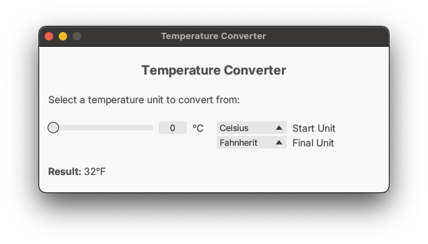

<p align="center">
  
</p>
<h1 align="center">≥v≥v&ensp;Temperature Converter&ensp;≥v≥v</h1>
<p align="center">
  
  &nbsp;
  
  &nbsp;
  
  &nbsp;
  
</p>

## ❡ About

A simple temperature converter. Also, my first graphical app made using Rust.

<p align="center">
  
</p>
<p align="center"><strong>Caption:</strong> a preview of the app.</p>

## ❡ Install

### Dependencies

The following dependencies must be installed before it:

- [**Rust Toolchain**](https://www.rust-lang.org): it will be used to build the project.
- **Git**: it will be used to clone this repository.

> [!TIP]
> Use your OS package manager or [HomeBrew](https://brew.sh) to install these packages.

### Procedures

- Clone this repository using `git`:

```zsh
git clone --depth 1 https://github.com/skippyr/temperature-converter;
```

- Access its directory using `cd`:

```zsh
cd temperature-converter;
```

- Build the app using `cargo`.

```zsh
cargo build --release;
```

- Run the app.

```zsh
target/release/temperature-converter;
```

- If you want, add it to your `PATH` environment variable for easy access.

## ❡ Help

If you need help related to this project, open a new issue in its [issues pages](https://github.com/skippyr/temperature-converter/issues) or send me an [e-mail](mailto:skippyr.developer@icloud.com) describing what is going on.

## ❡ Contributing

This project is open to review and possibly accept contributions in the form of bug reports and suggestions. If you are interested, send your contribution to its [pull requests page](https://github.com/skippyr/temperature-converter/pulls) or to my [e-mail](mailto:skippyr.developer@icloud.com).

## ❡ License

This is free software licensed under the BSD-3-Clause License that comes WITH NO WARRANTY. Refer to the LICENSE file that comes in its source code for license and copyright details.

&ensp;
<p align="center"><sup><strong>≥v≥v&ensp;Here Be Dragons!&ensp;≥v≥</strong><br />Made with love by skippyr <3</sup></p>
